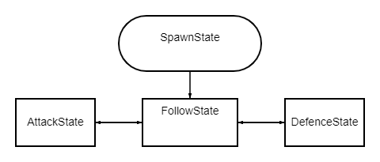

# fivem-bodyguard
Bodyguard script for gta5 fiveM

version 1:

SpawnState
    1) Появляются за пределами видимости игрока
    2) Двигаются к игроку пешком
    3) В зависимости от количесва юнитов им назначаются позиции с оффсетом вокруг игрока
    4) По умолчанию назначается поведение defence

FollowState
    1) Занимают позиции вокруг игрока в зависимости от количества юнитов (звездой)
    2) При переходе ownera на бег начинают бежать за ним
    3) При вступлении владельца в бой в зависимости от состояния defence/attack переходят в соответствующее состояние

DefenceState
    1) Смыкаются вокруг игрока
    2) Находят ближайший атакующий игрока юнит
    3) Те охранники которые находятся в направлении атакующего открывают огонь
    4) При смерти гвардов которые стоят между атакующим и владельцем их места занимают другие гварды

AttackState
    1) При нападении на владельца основной охранник остается рядом с ним (DefenceState)
    2) Остальные охранники пытаюстя занять укрытие и все начинают атаковать аггрессора

